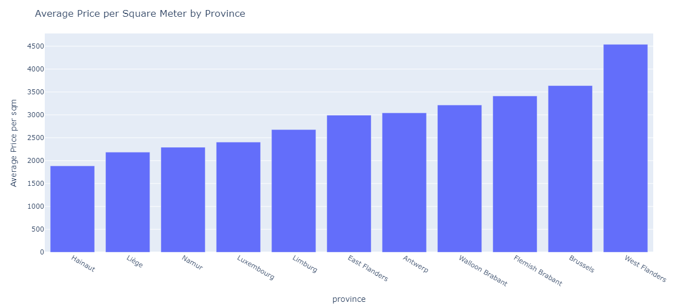

# Real Estate Market Monitoring with AirFlow


## DAG Details

- **Schedule Interval:** Daily at midnight (00:00)

## Tasks

### Task 1: `Retrieve and save the latest property listings from a remote dataset URL`

- **Task ID:** `download_and_filter_apartments`
- **Functionality:** Every night, we automatically retrieve the latest apartment listings from a remote dataset URL. These selected listings are then saved and organized for further analysis, allowing us to stay informed about the current offerings in the real estate market in Belgium.


### Task 2: `Deriving meaningful insights from the data in a visual representation`

- **Task ID:** `create_price_histogram`
- **Functionality:** This task analyzes the latest versioned apartment data to derive insightful statistics and generate a visual representation in the form of a price histogram. An HTML file containing a bar plot of average price per square meter by province is provided. 
- [View Price Histogram (HTML)](airflow/dags/data/price_histogram.html)
- 

## How to Use

#### Dependencies:
- **Docker:** The project requires Docker to containerize and manage the application's environment. Ensure Docker is installed on your system to build and run the application container.

- **Docker Compose:** Docker Compose is used to orchestrate multiple Docker containers as defined in the `docker-compose.yml` file. Make sure Docker Compose is installed to facilitate running the project stack with multiple services.

#### Running the Project with Docker Compose:
To run the project locally using Docker Compose, follow these steps:
1. **Clone the project repository:**
   ```bash
   git clone https://github.com/miguelallgood/immo-eliza-Airflow.git
   cd your-project
2. **Build Docker images for the project services:**
    ```bash
    docker-compose build
3. **Start the Docker container(s):**
    ```bash
    docker-compose up -d
4. **Access the Airflow Web Interface:**
Once the containers are up and running, access the Airflow web interface at http://localhost:8080.
    Use the default credentials to log in:
        Username: admin
        Password: Refer to the standalone_admin_password file provided with the project.
5. **Start Airflow Scheduler:** Start the Airflow scheduler to begin executing the DAG.
6. **Monitor Execution:** Monitor task execution and view the generated output files (`apartments_raw_data_{timestamp}.csv` and `price_histogram.html`) in the specified output folder.

For more details on each task and the functionality of this DAG, refer to the comments and docstrings within the DAG file (`download_and_analyze_apartments.py`).

**Note:** Ensure proper configuration of Airflow environment variables, scheduler, and worker nodes for seamless execution of tasks.

Feel free to reach out for any questions or issues related to this DAG!

## Contact

For any inquiries or feedback regarding this project, feel free to reach out to me:

- **Name:** Miguel Bueno
- **Email:** bueno.reyes.miguel@gmail.com
- **GitHub:** [miguelallgood](https://github.com/miguelallgood)

I welcome any questions, suggestions, or collaboration opportunities related to this project. Please feel free to get in touch!


